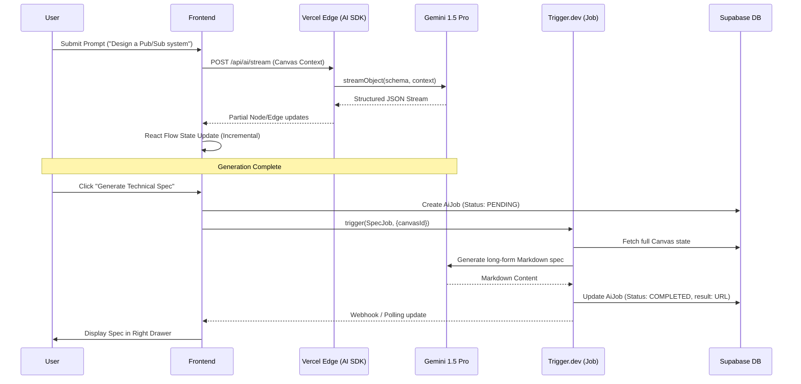

# LiveFlows — Product Requirements Document

## 1. Document Metadata

### 1.1 Product Identification

| Field | Value |
|---|---|
| **Product Name** | LiveFlows |
| **Tagline** | *Living Diagrams — where architecture meets execution.* |
| **Document Type** | Product Requirements Document (PRD) |
| **Version** | v1.0 |
| **Status** | Draft — pending stakeholder review |
| **Last Updated** | 2026-05-06 |
| **Document Owner** | Product Lead, LiveFlows |
| **Repository** | `liveflows/` (monorepo, Next.js 16 App Router) |
| **Canonical Path** | `docs/prd.md` |

### 1.2 Authors & Stakeholders

| Role | Responsibility | Sign-off Required |
|---|---|---|
| Product Lead | PRD authorship, scope ownership, OKR definition | Yes |
| Engineering Lead | Technical feasibility, architecture review (§8–§11) | Yes |
| Design Lead | UX flows, IA, theming (§5, §7) | Yes |
| AI/ML Lead | Provider strategy, prompt safety, streaming arch (§6.2, §6.3, §10) | Yes |
| Security & Compliance | SOC2 readiness, prompt-injection mitigations (§11) | Yes |
| Growth / GTM | Pricing, activation funnel, beta recruitment (§12–§14) | Yes |
| Founder / CEO | Vision, strategic alignment, final approval | Yes |
| Beta Customer Council | Feedback loop on §6 features during Phase 2 | Advisory |

### 1.3 Document Purpose

This PRD is the **single source of truth** for LiveFlows v1. It exists to:

1. **Align** product, engineering, design, AI, and GTM on what is being built and why.
2. **Define** functional and non-functional requirements precisely enough that engineering can plan and estimate without further discovery.
3. **Constrain** scope explicitly via numbered FRs and non-goals so feature creep is detectable.
4. **Anchor** acceptance — every Given/When/Then criterion in §6 is testable and traceable to a release.
5. **Surface** risks and open questions early (§15, §16) so they reach owners before they block delivery.

Downstream artifacts derive *from* this PRD, not parallel to it: Linear epics, Figma flows, the `context/architecture.md` reconciliation, the v1 RFC set, and the Phase-1 alpha test plan all cite section numbers from this document.

### 1.4 Scope Boundaries — What This PRD Does NOT Cover

The following are **explicitly out of scope** for v1.0 and this document:

| Out-of-Scope Area | Why Excluded | Tracked In |
|---|---|---|
| Mobile-native apps (iOS/Android) | Canvas + multi-cursor UX requires desktop-class input; mobile is *view-only* in v1. Native apps deferred to v2. | v2 Roadmap |
| Offline-first authoring (full CRDT replication on disk) | Liveblocks already handles short-window reconnect; full local-first storage is a 2-quarter rebuild. | RFC-LF-014 (deferred) |
| On-prem / self-hosted deployment | Enterprise tier in v1 is single-tenant cloud only. On-prem deferred until 5+ qualified leads. | Sales-pipeline gate |
| Custom LLM fine-tuning per workspace | v1 uses provider-hosted models with prompt-engineering only. Fine-tuning blocked on SOC2 + data-handling work. | RFC-LF-021 (deferred) |
| Voice / video collaboration in-canvas | Liveblocks supports it but v1 ships text chat + cursors only. | v2 Roadmap |
| Native code-execution from diagrams (e.g., terraform apply) | Hard security/blast-radius problem. v1 *exports* IaC, never runs it. | Permanent non-goal v1 |
| Real-time co-editing of generated specs (§6.3) | Specs render as Markdown but are single-author edits in v1. | v1.1 candidate |
| SAML / SCIM provisioning beyond Clerk's defaults | Clerk Enterprise tier covers most needs; advanced SCIM mappings deferred. | Enterprise-tier post-GA |
| Public REST API for third-party integrations | Internal tRPC only in v1. Public API gated on rate-limiting maturity. | v1.2 candidate |
| GDPR/CCPA data-portability beyond user-initiated export | Compliant baseline at GA; advanced data-rights tooling deferred. | Compliance roadmap |

### 1.5 Editorial Notes

- **Persona count.** The §6 brief originally referenced "3 target audiences," but four personas were specified in the source brief (Software Architect, Full-Stack Developer, Project Manager, Student Engineer). This PRD documents **all four** in §4 to maximize coverage; if Growth narrows the audience post-beta, this section will be updated and the dropped persona moved to §16 Open Questions.
- **Tech-stack reconciliation.** As of 2026-05-06, the repo's `package.json` includes Next.js 16.2.4, React 19.2.4, Prisma 7.8.0, Tailwind 4, and shadcn/ui — but **none** of the prompt-specified additions (Liveblocks, Vercel AI SDK, Trigger.dev, Clerk, Stripe, Upstash, Vercel Blob, Sentry, Zod, Supabase) are installed yet. This PRD describes the **target architecture**, not the current install. Engineering should treat the §17 *Stack Reconciliation* note as the install backlog for Phase-1 kickoff.
- **Date conventions.** All dates in this document are ISO-8601 (`YYYY-MM-DD`) in UTC. Phase milestones in §14 are relative ("T+0 weeks") to avoid stale calendar dates during review.
- **Requirement numbering.** Functional requirements use the form **FR-XXX** and are sequential across §6, §10, §11, and §13 with no gaps. Numbering restarts only between major versions of this PRD.

### 1.6 Technical Summary Table

The table below is the canonical at-a-glance view of the v1 technology choices. Detailed rationale lives in §10–§11; risk rows for each appear in §15.

| Category | Technology | Role | Key Constraints |
|---|---|---|---|
| **Frontend Framework** | Next.js 16 (App Router) | SSR, routing, edge functions, RSC for dashboard reads | React 19 only; no Pages Router; canvas routes are client-rendered |
| **Styling** | Tailwind CSS 4 + shadcn/ui | Design tokens, primitive component library | Dark theme default; tokens defined in `app/globals.css` |
| **Canvas Engine** | React Flow 12 | Node/edge model, Portal hierarchy, viewport perf | 60fps target up to 500 nodes; custom nodes via `nodeTypes` registry |
| **Realtime CRDT** | Liveblocks | Room storage, Presence, multi-cursor, conflict resolution | <50ms p95 echo latency; rooms expire after 30d inactivity |
| **AI Streaming** | Vercel AI SDK (`streamObject`) | Structured-JSON streaming from LLM to canvas | First-token <800ms; cancellation via `AbortController` |
| **AI Providers** | Gemini 1.5 Pro → GPT-4o → Claude 3.5 Sonnet | Primary → fallback → secondary fallback chain | Provider abstraction via SDK; per-request cost cap enforced upstream |
| **Background Jobs** | Trigger.dev v4 | Spec generation, snapshot rendering, exports | 10-min hard timeout; 3 retries with exponential backoff |
| **Primary DB** | Supabase Postgres (via Prisma) | Users, Orgs, Projects, Canvases, Tasks, Templates, AuditLogs | RLS off (Prisma owns auth); pgvector optional for v1.1 search |
| **Cache & Quotas** | Upstash Redis | AI credit ledger, rate limits, session metadata | 5s TTL on rate windows; credit ops use Lua atomic scripts |
| **Blob Storage** | Vercel Blob | PDF exports, Portal thumbnails, template previews | Signed URLs only; org-scoped path prefixes |
| **Auth & Orgs** | Clerk | OAuth, magic link, SSO, Org membership | Org → Liveblocks room mapping is 1:N; SSO is Enterprise-tier |
| **Billing** | Stripe | Subscriptions, one-time credit packs, webhooks | No PAN storage on our side; webhook signatures verified |
| **Validation** | Zod | All API I/O, AI streamed JSON, form, job payload schemas | Schemas exported from `@/lib/schemas` and reused on client + server |
| **Observability** | Sentry | Errors, performance traces (AI + Liveblocks spans) | Sample rate 100% errors / 10% perf; PII scrubbing on |
| **Local Dev** | Docker + WSL2 | Postgres + Redis + Trigger.dev worker via compose | Developers on Windows must use WSL2; Mac uses Docker Desktop |
| **Hosting** | Vercel | App + edge functions; Trigger.dev workers separate | Edge runtime for AI streaming routes; Node runtime for Prisma |

---

*Section 1 of 17 — see §2 Executive Summary for problem framing and product vision.*

---

## 2. Executive Summary

### 2.1 Problem Statement

Modern engineering teams work across a fractured set of tools that were never designed to talk to each other. A software architect opens Miro to sketch a microservices boundary. A developer translates that sketch — manually, lossy — into Notion tickets. A project manager re-enters those tickets into Jira sprints. A junior engineer stares at the resulting backlog with no connection back to the original design rationale. By the time code ships, the diagram is stale, the tickets have drifted, and the architecture decision records live in someone's head or a forgotten Confluence page.

This fragmentation has three compounding costs:

1. **Translation tax.** Every handoff from diagram → spec → ticket → code is a context-lossy manual step. Teams spend an estimated 20–30% of planning time in translation rather than design.
2. **Diagram rot.** Because diagrams are created in tools disconnected from execution, they stop being updated after the first sprint. Within 90 days, most architecture diagrams are wrong in ways nobody tracks.
3. **AI context gap.** LLMs are now capable of generating meaningful architecture scaffolding, but existing tools treat AI as an isolated chat assistant rather than a canvas-native collaborator. The AI generates text; the engineer then manually draws what the AI described.

LiveFlows is the missing layer: a canvas where diagrams are *living* — continuously synchronized with the work that flows from them, and AI-native from the first node.

### 2.2 Product Vision

> **LiveFlows is the living diagram platform for engineering teams — where system design, AI generation, and task execution share a single canvas.**

A "living diagram" is one that stays true: it reflects the current architecture, not the architecture as it was imagined at sprint zero. When an AI generates a microservices topology on the canvas, the spec and the tasks generate with it. When the spec changes, the tasks update. When work is exported to Jira, the link back to the diagram persists. The diagram is never a snapshot; it is the source.

### 2.3 Mission Statement

> **LiveFlows' mission is to collapse the time between thinking a system and building it — by making AI-generated architecture diagrams the executable source of truth for engineering teams.**

Every feature decision should be testable against this mission: does it reduce the gap between design and execution? If not, it does not belong in v1.

### 2.4 Strategic Opportunity & Market Positioning

The diagramming and visual collaboration market is large (~$2.5B in 2024, growing at ~14% CAGR) but poorly segmented for engineering workflows. The dominant tools fall into two camps that LiveFlows bridges:

| Competitor Tier | Examples | Strength | Gap LiveFlows Exploits |
|---|---|---|---|
| General-purpose whiteboarding | Miro, Mural, FigJam | Rich freehand + sticky notes; broad adoption | No structured node model; no AI-to-canvas streaming; no task/spec export |
| Diagram-as-code / structured | Lucidchart, draw.io | Precise diagramming; export fidelity | Primarily import/export flows; minimal real-time collab; no AI generation |
| Developer-native + AI | Eraser.io, Whimsical | Markdown + diagram hybrid; fast | No multi-player CRDT; AI is chat-adjacent, not canvas-native; no task orchestration |
| IaC & architecture tools | Structurizr, Cloudcraft | Deep infra fidelity | Single-player; no AI gen; steep learning curve; no task export |

LiveFlows' defensible position is the **intersection of three capabilities** that no single competitor holds simultaneously:
- **Realtime multi-player canvas** (Liveblocks CRDT, <50ms echo latency)
- **Stream-to-canvas AI generation** (structured JSON streamed directly into React Flow, not into a chat box)
- **Diagram-to-task orchestration** (Trigger.dev background jobs produce specs, tasks, and Jira-compatible exports from canvas state)

The beachhead segment is **engineering teams at Series A–C startups (10–150 engineers)** who are sophisticated enough to want structured AI tooling but too resource-constrained to build internal tooling. Expansion targets: enterprise platform teams with 150+ engineers who need the audit log and SSO gating.

### 2.5 Success Definition

LiveFlows will be successful at the end of v1 (Phase 3 GA, see §14) when a cross-functional engineering team — architect, developers, PM — can open a shared canvas, prompt the AI to generate a distributed system topology, review and refine the diagram together in real time, trigger a background spec-generation job, receive a structured technical specification and actionable task list, and export that list to their project management tool of choice — all without leaving LiveFlows, and all in under 15 minutes from blank canvas to exported sprint backlog. That end-to-end flow, repeatable by any team with no LiveFlows training, is the v1 north star.

---

*Section 2 of 17 — see §3 Goals & Non-Goals for OKR-format success criteria.*

---

## 3. Goals & Non-Goals

### 3.1 Product Goals (OKRs)

LiveFlows v1 success is measured by five primary objectives. Each goal is paired with three measurable Key Results (KRs) to be achieved by the end of Phase 3.

**Goal 1: Deliver a "Frictionless AI Generation" Experience**
*Objective: Make AI feel like a native collaborator that understands technical intent, not just a text generator.*
- **KR 1.1:** Average time from "blank canvas" to "first AI-generated node set" is under 30 seconds for 95% of users.
- **KR 1.2:** 80% of users report "High" or "Very High" satisfaction with the initial layout and technical accuracy of AI-generated diagrams.
- **KR 1.3:** Support streaming of 50+ nodes in a single prompt with < 1s first-token latency across all supported providers.

**Goal 2: Establish Real-Time Collaboration Excellence**
*Objective: Provide a multi-player experience that is as responsive as a local application.*
- **KR 2.1:** Maintain sub-50ms p95 echo latency for cursor movements and node transformations across 4+ simultaneous editors.
- **KR 2.2:** Zero data-loss events reported due to CRDT synchronization conflicts during the first 6 months of GA.
- **KR 2.3:** 70% of active projects have 2+ unique collaborators per week, signaling the tool is being used for team design, not just solo sketching.

**Goal 3: Bridge the Design-to-Execution Gap**
*Objective: Prove that diagrams can drive actual work, not just documentation.*
- **KR 3.1:** 50% of users who generate an AI diagram also trigger a "Specification Generation" job within the same session.
- **KR 3.2:** Support export to at least two major issue trackers (Jira, GitHub Issues) with 99.9% successful payload delivery.
- **KR 3.3:** Average time from "Diagram Approval" to "Exported Task List" is under 5 minutes for a standard system architecture.

**Goal 4: Build a Performance-First Canvas**
*Objective: Ensure the UI remains fluid even as system complexity grows.*
- **KR 4.1:** Maintain a consistent 60fps frame rate for viewport panning and zooming with up to 500 active nodes/edges.
- **KR 4.2:** Initial canvas load time (Time to Interactive) is under 2 seconds on a standard 4G connection.
- **KR 4.3:** 99.9% uptime SLA for the Liveblocks room coordination service and the AI streaming edge routes.

**Goal 5: Drive Sustainable Growth & Retention**
*Objective: Build a product that engineers return to for every new project.*
- **KR 5.1:** 30% day-28 retention for users who complete the "First AI Generation" flow.
- **KR 5.2:** Convert 5% of free-tier workspaces to a paid Pro or Enterprise plan within 90 days of onboarding.
- **KR 5.3:** Grow the community template library to 50+ high-quality architecture patterns within 3 months of GA.

### 3.2 Non-Goals

To maintain focus and ensure a high-quality v1 release, the following areas are explicitly **out of scope**.

1. **Native Mobile Authoring Apps**
   - *Rationale:* Precise architecture diagramming requires a mouse/keyboard for complex node management. v1 focuses on a high-fidelity desktop web experience. Mobile will be "view-only" to avoid fragmenting resources on complex touch-canvas interactions.
2. **Offline-First / Local-First Storage**
   - *Rationale:* Implementing a full local-first sync engine with persistent disk storage is a significant technical undertaking. v1 relies on Liveblocks' robust reconnection logic for short network interruptions. Full offline mode is deferred to v2.
3. **Native Code Execution (Live Environments)**
   - *Rationale:* LiveFlows is a design and orchestration tool, not a CI/CD platform. Executing code or deploying infrastructure directly from the canvas introduces security and blast-radius risks that are out of scope for the initial product.
4. **General-Purpose Illustration Tool**
   - *Rationale:* We are not building a replacement for Figma or generic whiteboards. We will not support freehand drawing, complex vector masking, or non-technical artistic primitives. Every node should map to a technical or procedural entity.
5. **Real-Time Video/Audio Chat**
   - *Rationale:* Teams already have specialized tools like Zoom, Slack, and Huddles. While Liveblocks supports it, we will prioritize canvas-native presence (cursors, follows) and text comments over building a competing communication stack.
6. **In-Canvas IDE / Code Editor**
   - *Rationale:* Developers have established workflows in VS Code and IntelliJ. LiveFlows provides the high-level architecture view and generates specs; it is not meant to be the environment where the final lines of code are written.
7. **Public Integration Marketplace for Third Parties**
   - *Rationale:* To maintain quality and stability, all integrations (Jira, GitHub, Slack) will be first-party in v1. A public SDK and marketplace for 3rd party developers is a v2 milestone.

---

*Section 3 of 17 — see §4 User Personas for detailed audience profiles.*

---

## 4. User Personas

LiveFlows serves four primary personas. Each has unique requirements for how they interact with the canvas, the AI, and the downstream task orchestration.

### 4.1 Sarah, the Software Architect (The Visionary)

Sarah is responsible for high-level system design and ensuring that complex migrations align with long-term technical goals.

| Attribute | Profile |
|---|---|
| **Role** | Senior Lead Architect at a mid-sized fintech or high-growth startup. |
| **Workflow** | Sketches microservices boundaries, evaluates tech debt, and drafts RFCs for system changes. |
| **Pain Points** | Static diagrams in Miro or Lucidchart drift within weeks; manual effort to translate drawings into technical specifications. |
| **JTBD** | "Design resilient, scalable systems that are clearly understood and executable by the engineering team." |
| **Success Metrics** | Reduction in architectural drift; 20% faster sign-off on RFCs due to visual clarity. |

### 4.2 Alex, the Full-Stack Developer (The Builder)

Alex is focused on delivery—taking high-level designs and turning them into working code, starting with schemas and API definitions.

| Attribute | Profile |
|---|---|
| **Role** | Mid-level Engineer who owns features from DB schema to frontend components. |
| **Workflow** | Maps out data models and API flows before implementing; uses AI to generate boilerplate. |
| **Pain Points** | Manual translation of architecture diagrams into Prisma schemas or Zod types; lack of a single source of truth between design and code. |
| **JTBD** | "Quickly transition from a visual system flow to a working code scaffolding that I can actually use." |
| **Success Metrics** | 30% reduction in 'time to first PR' for new services; high fidelity between design and final schema. |

### 4.3 Marcus, the Project Manager (The Orchestrator)

Marcus manages the delivery pipeline and ensures that the team's visual planning translates into tracked, actionable work.

| Attribute | Profile |
|---|---|
| **Role** | Technical PM or Engineering Manager in a platform or product team. |
| **Workflow** | Sprint planning, backlog grooming, and ensuring that high-level designs are broken down into tickets. |
| **Pain Points** | Context loss between "visionary" planning meetings and the resulting Jira backlog; manual ticket creation from meeting notes. |
| **JTBD** | "Ensure every node in a diagram is accounted for in a sprint and tracked through to completion without manual re-entry." |
| **Success Metrics** | 100% traceability from diagram nodes to Jira/GitHub tickets; zero lost requirements during handoff. |

### 4.4 Leo, the Student Engineer (The Learner)

Leo is building his technical foundation and uses LiveFlows to learn industry-standard patterns through AI-assisted generation.

| Attribute | Profile |
|---|---|
| **Role** | Final-year CS student, Bootcamp grad, or Junior Engineer in an onboarding phase. |
| **Workflow** | Explores system design patterns (e.g., event-driven, pub/sub) and builds portfolio projects. |
| **Pain Points** | Overwhelmed by "best practices" that aren't visually mapped; lacks a mental model for distributed systems. |
| **JTBD** | "Learn complex architecture patterns by interacting with AI-generated examples that follow production-grade standards." |
| **Success Metrics** | Successful deployment of a distributed system project; improved performance in technical interviews. |
---

*Section 4 of 17 — see §5 User Journey Maps for persona-specific task flows.*

---

## 5. User Journey Maps

This section maps the end-to-end experience for each persona, highlighting the "AI Moment" and the "Frictionless Export" that define LiveFlows.

### 5.1 Sarah (The Architect): The Design-to-Spec Journey

Sarah's journey focuses on high-level validation and structured output.

1.  **Discovery:** Sees a technical blog post or Twitter thread about "Living Diagrams" and AI-native architecture.
2.  **Onboarding:** Signs up via GitHub (Clerk), creates a "Fintech Core" workspace, and invites two Lead Engineers.
3.  **Core Task:** Opens a blank canvas to map out a new ledger service.
4.  **Collab:** Tags her peers in a comment on a "Database" node to discuss sharding strategies.
5.  **AI Moment:** Prompts the AI: *"Generate a resilient ledger architecture with a message queue, double-entry nodes, and a reconciliation service."* The AI streams 15 nodes and 20 edges directly onto her canvas in 8 seconds.
6.  **Export:** Triggers the "Technical Spec" job. Trigger.dev generates a 10-page Markdown RFC including a Mermaid diagram derived from the canvas.
7.  **Return:** Returns 2 weeks later to update the diagram; notices the spec can be re-generated to reflect the new "Audit Log" node she added.

### 5.2 Alex (The Builder): The Flow-to-Code Journey

Alex's journey focuses on speed and developer-ready scaffolding.

1.  **Discovery:** Find a template in the marketplace for "Next.js + Supabase + Stripe" and clicks "Use This Template."
2.  **Onboarding:** Lands directly on a pre-populated canvas with a logical data flow.
3.  **Core Task:** Modifies the "User Table" node to include `subscription_status` and `stripe_id`.
4.  **Collab:** Uses the "Follow" feature to watch Sarah explain a change to the auth flow in real time.
5.  **AI Moment:** Selects the "User" and "Payment" nodes and prompts: *"Generate a Prisma schema and Zod validation for this relationship."* A code drawer opens with ready-to-copy-paste TypeScript.
6.  **Export:** Clicks "Export Tasks" and selects "GitHub Issues." LiveFlows creates a milestone with 5 issues, each containing the node's requirements.
7.  **Return:** Uses LiveFlows as the "read-me" for the repo, keeping the diagram open while coding to maintain context.

### 5.3 Marcus (The PM): The Planning-to-Ticket Journey

Marcus's journey focuses on traceability and accountability.

1.  **Discovery:** Sarah invites Marcus to the "Ledger Migration" workspace to review the roadmap.
2.  **Onboarding:** Joins the workspace and receives a tour of the canvas layout.
3.  **Core Task:** Reviews the AI-generated nodes for completeness against the product roadmap.
4.  **Collab:** Uses a sticky note (non-technical node) to mark "Blocked by Legal review."
5.  **AI Moment:** Prompts the canvas: *"Estimate complexity and suggest a 3-sprint breakdown for these 12 service nodes."* The AI overlays priority markers and suggested sprint numbers on the nodes.
6.  **Export:** Connects the workspace to Jira. One-click syncs the entire diagram into a Jira Epic, where each node becomes a Story linked back to the LiveFlows canvas URL.
7.  **Return:** Checks the LiveFlows canvas weekly during syncs to visualize which "nodes" are marked as "Done" in Jira (bi-directional sync in v1.1).

### 5.4 Leo (The Learner): The Pattern-to-Knowledge Journey

Leo's journey focuses on exploration and "best practice" discovery.

1.  **Discovery:** Searches for "how to design an event-driven system" and finds a LiveFlows community template.
2.  **Onboarding:** Fork the template into his personal "Learning" workspace.
3.  **Core Task:** Tries to add a "Websocket" node but isn't sure where it fits.
4.  **Collab:** Shares a public "View-Only" link to his canvas on a Discord community for feedback.
5.  **AI Moment:** Highlights the entire canvas and prompts: *"Explain the data flow here and suggest 3 ways to make it more fault-tolerant."* The AI highlights potential bottlenecks in red and adds "Best Practice" callout nodes.
6.  **Export:** Exports the canvas as a high-res PDF for his portfolio, including the AI-generated technical explanation.
7.  **Return:** Uses the "History" slider to see how his architecture evolved from a basic sketch to a professional pattern.

---

*Section 5 of 17 — see §6 Feature Requirements for functional specifications.*

---

## 6. Feature Requirements

### 6.1 Real-Time Multi-Player Canvas

The canvas is the primary interaction surface, built on React Flow and Liveblocks to support high-performance, synchronized diagramming.

| Requirement ID | Description | Priority |
|---|---|---|
| **FR-101** | Support infinite canvas with panning, zooming (0.1x to 5x), and mini-map navigation. | P0 |
| **FR-102** | Real-time presence: visible multi-player cursors with user names and profile colors. | P0 |
| **FR-103** | CRDT-based node management: add, delete, resize, and move nodes with zero-conflict resolution. | P0 |
| **FR-104** | Edge orchestration: support straight, step, and smoothstep edges with configurable markers (arrows). | P0 |
| **FR-105** | Node types: support technical (service, DB, queue), logical (boundary, group), and annotation (sticky note) nodes. | P0 |
| **FR-106** | "Follow" mode: allow a user to sync their viewport to another user's view in real time. | P1 |

**Acceptance Criteria:**
- **Given** multiple users are in the same room, **When** User A moves a node, **Then** User B sees the movement smoothly at 60fps.
- **Given** a network interruption, **When** the connection is restored, **Then** the canvas reconciles state using Liveblocks CRDTs without data loss.

**Edge Cases:**
- Simultaneous deletion of the same node by two users (Liveblocks handles via "last-writer-wins" or deterministic order).
- Dragging a node off the "infinite" bounds (viewport should center on selection).

**Dependencies:** React Flow 12, Liveblocks, `@/lib/schemas/canvas.ts` (Zod).

---

### 6.2 Stream-to-Canvas AI Generation

This feature enables users to generate complex architectures from natural language prompts, with results appearing incrementally on the canvas.

| Requirement ID | Description | Priority |
|---|---|---|
| **FR-201** | Stream structured JSON from LLM (Gemini 1.5 Pro) to React Flow state using Vercel AI SDK `streamObject`. | P0 |
| **FR-202** | Support partial-state rendering: nodes and edges appear as they are parsed from the stream. | P0 |
| **FR-203** | Auto-layout engine: generated nodes must be positioned using a layout algorithm (Dagre or Elk) to avoid overlap. | P0 |
| **FR-204** | Prompt context: AI must have access to existing canvas state (nodes/edges) to perform "Add-on" or "Refactor" prompts. | P1 |
| **FR-205** | Cancellation: users must be able to stop a generation mid-stream without corrupting the canvas. | P0 |

**Acceptance Criteria:**
- **Given** a blank canvas, **When** a user prompts "A basic CRUD app with auth," **Then** the first node appears within 1.5 seconds and the full diagram completes within 10 seconds.
- **Given** an invalid AI response, **When** the stream contains broken JSON, **Then** the Zod validator catches the error and provides a graceful fallback UI.

**Edge Cases:**
- Prompting for 100+ nodes (UI should show a progress bar; potential performance throttling).
- LLM hallucinating node types that don't exist in our registry (registry must have a "Default" fallback).

**Dependencies:** Vercel AI SDK, Gemini API, Dagre/Elk layout engine.

---

*Section 6.2 of 17 — see §6.3 for AI Specification & Task Orchestration.*

---

### 6.3 AI Specification & Task Orchestration

This section defines the "living" nature of the diagram, where canvas nodes are transformed into structured technical documents and actionable tasks.

| Requirement ID | Description | Priority |
|---|---|---|
| **FR-301** | Technical Spec Generation: Transform canvas state into a multi-section Markdown document via Trigger.dev. | P0 |
| **FR-302** | Task Extraction: Identify logical work units from nodes and edges to create a structured task list. | P0 |
| **FR-303** | Code Scaffolding: Generate boilerplate (Prisma, Zod, API routes) for specific technical nodes. | P1 |
| **FR-304** | Third-party Export: Sync generated tasks to Jira (Stories) and GitHub (Issues). | P0 |
| **FR-305** | Bi-directional Linkage: Store the LiveFlows canvas URL in exported tickets for context. | P1 |

**Acceptance Criteria:**
- **Given** a canvas with 10 nodes, **When** the "Generate Spec" job is triggered, **Then** a background worker produces a document within 60 seconds.
- **Given** a Jira connection, **When** a user clicks "Export to Jira," **Then** each node becomes a Jira Story with a title, description, and link back to the node.

**Zod Schema (Task Export Request):**
```typescript
const TaskExportSchema = z.object({
  canvasId: z.string().uuid(),
  provider: z.enum(["JIRA", "GITHUB"]),
  targetId: z.string(), // Project key or Repo name
  nodes: z.array(z.object({
    id: z.string(),
    title: z.string(),
    description: z.string().optional(),
    type: z.string(),
    metadata: z.record(z.any()),
  })),
});
```

**Dependencies:** Trigger.dev, Jira/GitHub APIs, Vercel Blob (for storing generated docs).

---

### 6.4 Team Collaboration & Workspaces

LiveFlows supports organizational hierarchies and team-based access control.

| Requirement ID | Description | Priority |
|---|---|---|
| **FR-401** | Organizations: support multiple workspaces per organization. | P0 |
| **FR-402** | Role-Based Access Control (RBAC): Admin, Editor, Viewer roles at the project level. | P0 |
| **FR-403** | In-Canvas Chat: threaded comments linked to specific nodes or coordinates. | P1 |
| **FR-404** | Activity Feed: a log of changes (who moved what, who triggered a spec generation). | P2 |

**Acceptance Criteria:**
- **Given** a "Viewer" role, **When** a user tries to move a node, **Then** the UI prevents the action and shows a "Read-only" tooltip.

**Dependencies:** Clerk Organizations, Prisma (RBAC mappings).

---

### 6.5 Community Marketplace & Templates

A repository of high-quality architecture patterns to accelerate onboarding.

| Requirement ID | Description | Priority |
|---|---|---|
| **FR-501** | Template Library: browse and preview pre-built architecture diagrams. | P1 |
| **FR-502** | One-Click Fork: copy a template into a personal workspace as a new project. | P1 |
| **FR-503** | Template Submission: allow users to mark a project as a "Template" (Private or Public). | P2 |

**Dependencies:** Vercel Blob (thumbnails), Supabase (template metadata).

---

### 6.6 Authentication & User Management

Secure, enterprise-ready authentication via Clerk.

| Requirement ID | Description | Priority |
|---|---|---|
| **FR-601** | OAuth Sign-in: support GitHub and Google as primary auth methods. | P0 |
| **FR-602** | Magic Link: passwordless login for high-security environments. | P1 |
| **FR-603** | Session Persistence: maintain user session across tabs and canvas reloads. | P0 |

**Dependencies:** Clerk.

---

*Section 6 of 17 — see §7 for Information Architecture & Navigation.*

---

## 7. Information Architecture & Navigation

LiveFlows uses a hierarchical structure centered around the **Project Canvas**.

### 7.1 Sitemap & Navigation

- **Global Navigation:** Dashboard, Templates, Settings, Help.
- **Workspace Navigation:** Project list, Org members, Billing.
- **Canvas Navigation:** Viewport controls (zoom/pan), Toolbars (AI, Nodes, Export), Sidebar (Comments, Spec, Settings).

### 7.2 Canvas Layout

- **Top Bar:** Breadcrumbs, Real-time presence (avatars), Share button, Status (Saved/Syncing).
- **Left Toolbar:** Select tool, Hand tool, Node palette (Service, DB, Gateway, Group), Annotation tool (Text, Sticky).
- **Bottom Center:** AI Prompt bar (fixed, collapsible).
- **Right Drawer:** Contextual properties (Node name, metadata, code snippet), Project settings.
- **Overlays:** Mini-map (bottom-right), Viewport controls (bottom-left).

### 7.3 Keyboard Shortcuts Map

| Key | Action |
|---|---|
| `V` / `H` | Select / Hand tool |
| `Space` + Drag | Pan viewport |
| `Cmd/Ctrl + K` | Open AI Prompt bar |
| `Delete` / `Backspace` | Remove selected nodes/edges |
| `Cmd/Ctrl + Z / Y` | Undo / Redo (local state) |
| `?` | Open keyboard shortcuts help |

---

## 8. Data Models

LiveFlows uses Prisma with Supabase Postgres. The schema is optimized for organizational multitenancy and AI-integrated workflows.

### 8.1 Prisma Schema

```prisma
// This is a representative subset of the schema

enum Plan {
  FREE
  PRO
  ENTERPRISE
}

model Organization {
  id        String    @id @default(uuid())
  name      String
  slug      String    @unique
  plan      Plan      @default(FREE)
  users     Member[]
  projects  Project[]
  createdAt DateTime  @default(now())
}

model Member {
  id             String       @id @default(uuid())
  userId         String       // Clerk User ID
  organizationId String
  role           String       // Admin, Editor, Viewer
  organization   Organization @relation(fields: [organizationId], references: [id])
}

model Project {
  id             String       @id @default(uuid())
  name           String
  organizationId String
  organization   Organization @relation(fields: [organizationId], references: [id])
  canvases       Canvas[]
  templates      Template[]
  createdAt      DateTime     @default(now())
}

model Canvas {
  id        String   @id @default(uuid())
  projectId String
  project   Project  @relation(fields: [projectId], references: [id])
  nodes     Node[]
  edges     Edge[]
  aiJobs    AiJob[]
  tasks     Task[]
  version   Int      @default(1)
  updatedAt DateTime @updatedAt
}

model Node {
  id        String   @id
  canvasId  String
  canvas    Canvas   @relation(fields: [canvasId], references: [id])
  type      String   // 'service', 'database', etc.
  positionX Float
  positionY Float
  data      Json     // Label, custom metadata
}

model Edge {
  id       String @id
  canvasId String
  canvas   Canvas @relation(fields: [canvasId], references: [id])
  source   String
  target   String
  data     Json?
}

model AiJob {
  id        String   @id @default(uuid())
  canvasId  String
  canvas    Canvas   @relation(fields: [canvasId], references: [id])
  type      String   // 'SPEC_GEN', 'TASK_EXTRACTION'
  status    String   // 'PENDING', 'RUNNING', 'COMPLETED', 'FAILED'
  payload   Json?
  result    String?  // URL to blob storage (Markdown/PDF)
  createdAt DateTime @default(now())
}

model Task {
  id        String   @id @default(uuid())
  canvasId  String
  canvas    Canvas   @relation(fields: [canvasId], references: [id])
  nodeId    String?
  title     String
  status    String   // 'BACKLOG', 'TODO', 'DONE'
  externalId String? // Jira/GitHub issue ID
}
```

---

## 9. API Design

LiveFlows uses **tRPC** for type-safe internal communication and **REST** for webhook handling and legacy integrations.

### 9.1 tRPC Endpoints (Procedures)

| Domain | Procedure | Method | Description |
|---|---|---|---|
| **Canvas** | `canvas.get` | QUERY | Fetch initial room state and model metadata. |
| **Canvas** | `canvas.update` | MUTATION | Update metadata (non-CRDT) like name or organization. |
| **AI** | `ai.generate` | MUTATION | Trigger AI generation (streaming handled via Vercel AI SDK route). |
| **AI** | `ai.getJobStatus`| QUERY | Poll or subscribe to Trigger.dev job updates. |
| **Orgs** | `org.list` | QUERY | Fetch organizations for the current user. |
| **Tasks** | `task.export` | MUTATION | Trigger export job to Jira/GitHub. |

### 9.2 AI Streaming Route (POST `/api/ai/stream`)

This route bypasses tRPC to support standard ReadableStream responses.

**Request Payload:**
```typescript
const AiStreamRequest = z.object({
  canvasId: z.string().uuid(),
  prompt: z.string().min(1).max(2000),
  context: z.object({
    existingNodes: z.array(z.any()), // Subset of canvas state
    existingEdges: z.array(z.any()),
  }),
});
```

**Response:** A stream of JSON objects representing incremental updates to the React Flow node/edge arrays.

---

*Section 9 of 17 — see §10 for Real-Time & AI Architecture.*

---

## 10. Real-Time & AI Architecture

LiveFlows integrates three core systems: the **Canvas CRDT Layer**, the **AI Streaming Engine**, and the **Background Job Orchestrator**.

### 10.1 Data Flow Diagram (AI Generation Pipeline)



### 10.2 Liveblocks Room Lifecycle

1.  **Room Creation:** Each `Canvas` record maps to a unique Liveblocks Room ID (`canvas_${uuid}`).
2.  **Storage Schema:**
    - `nodes`: LiveMap of `Node` objects.
    - `edges`: LiveMap of `Edge` objects.
    - `metadata`: LiveObject for canvas settings (grid, background).
3.  **Presence:** Cursor positions and selection states are non-persistent (broadcast-only).
4.  **Persistence:** Liveblocks webhooks trigger every 5 minutes to sync the CRDT state back to the Supabase Postgres `Node` and `Edge` tables for indexing and backup.

### 10.3 Background Job Definitions (Trigger.dev)

- **`spec-generation-v1`:**
    - Trigger: Manual UI action or Canvas change (debounced).
    - Task: Aggregates node metadata -> Prompts LLM for technical explanation -> Renders Mermaid diagram -> Saves to Vercel Blob.
- **`task-sync-jira`:**
    - Trigger: Export button.
    - Task: Maps nodes to Jira Stories -> Batch creates issues -> Updates local `Task` records with `externalId`.

---

## 11. Non-Functional Requirements

### 11.1 Performance Targets

- **Canvas Fluidity:** 60fps for all viewport transformations with up to 500 nodes.
- **AI Latency:** First-token delivery < 800ms for 90% of requests.
- **Sync Latency:** < 50ms p95 echo latency for multi-player presence.
- **Initial Load:** Time to Interactive (TTI) < 2.0s on standard desktop connections.

### 11.2 Reliability & Scalability

- **Uptime:** 99.9% availability for core canvas and auth services.
- **Provider Fallback:** If Gemini 1.5 Pro (P0) fails, route to GPT-4o (P1) within 2 seconds.
- **Concurrency:** Support up to 50 simultaneous editors per canvas room without performance degradation.

### 11.3 Security & Compliance

- **Auth:** Clerk-managed JWTs for all API requests.
- **Prompt Safety:** Input sanitization to prevent prompt injection; PII scrubbing on outbound LLM calls.
- **Data Isolation:** Organization-level RLS (Row Level Security) and tenant-scoped Liveblocks rooms.

---

## 12. Analytics & Success Metrics

### 12.1 Key Performance Indicators (KPIs)

| Metric | Definition | Target (GA) |
|---|---|---|
| **Activation Rate** | % of sign-ups who generate an AI diagram | 40% |
| **Engagement Depth**| Average nodes per canvas per weekly active user | 15+ nodes |
| **Collab Density** | % of projects with 2+ active collaborators | 60% |
| **Retention (D28)** | % of users returning after 4 weeks | 25% |
| **Export Velocity** | % of users who export tasks to Jira/GitHub | 15% |

### 12.2 Event Instrumentation Table

| Event Name | Trigger | Properties |
|---|---|---|
| `ai_prompt_submitted` | User clicks 'Generate' | prompt_length, provider, canvas_id |
| `ai_stream_completed` | Stream finishes | node_count, edge_count, duration_ms |
| `spec_job_triggered` | User clicks 'Generate Spec' | job_type, node_count |
| `task_exported` | Export job completes | target_provider (Jira/GH), task_count |
| `presence_joined` | User enters room | room_id, role |

---

*Section 12 of 17 — see §13 for Monetization & Pricing Tiers.*

---

## 13. Monetization & Pricing Tiers

LiveFlows uses a "Freemium + Credit" model. Organizations can subscribe to tiers for collaboration features and buy credits for AI operations.

### 13.1 Feature Matrix

| Feature | Free | Pro | Enterprise |
|---|---|---|---|
| **Users** | Up to 3 | Unlimited | Unlimited |
| **Canvases** | 2 active | Unlimited | Unlimited |
| **AI Generation** | 10 credits/mo | 500 credits/mo | Unlimited (SLA-based) |
| **Collaboration** | Cursors only | Cursors + Comments | RBAC + SSO |
| **Exports** | PDF/Markdown | Jira/GitHub | Custom Webhooks |
| **History** | 7 days | 30 days | 1 year |
| **SLA** | Community | Email (24h) | Dedicated (4h) |

### 13.2 Credit Consumption (Upstash Redis Ledger)

- **Diagram Generation:** 1 credit per 10 nodes generated.
- **Spec Generation:** 5 credits per job.
- **Task Export:** 2 credits per export.

---

## 14. Rollout & Launch Plan

The release is divided into three T-minus phases to ensure stability before GA.

### 14.1 Launch Phases

| Phase | Timeline | Target Audience | Success Criteria |
|---|---|---|---|
| **Phase 1: Alpha** | T+0 weeks | Internal + 5 Design Partners | 60fps canvas; successful AI streaming. |
| **Phase 2: Beta** | T+4 weeks | Waitlist (500 users) | Zero data loss in CRDT; < 1s AI latency. |
| **Phase 3: GA** | T+8 weeks | General Public | 5% conversion rate; < 50ms sync latency. |

### 14.2 Feature Flag Strategy

We will use a custom feature flag system (or a lightweight provider) to gate:
- AI model fallbacks (test Gemini vs GPT-4o in production).
- Jira/GitHub integrations (Beta-only).
- SSO/Enterprise billing (Enterprise-only).

---

## 15. Risks & Mitigations

### 15.1 Technical Risk Register

| Risk ID | Technology | Category | Impact | Mitigation Strategy |
|---|---|---|---|---|
| **R-101** | **Liveblocks** | Connectivity | High | Implement robust retry logic; show "Offline" indicator; persistent local cache. |
| **R-102** | **Gemini API** | Rate Limits | High | Provider fallback chain (Gemini → GPT-4o → Claude); Upstash rate-limiting. |
| **R-103** | **Trigger.dev** | Reliability | Medium | Idempotent job definitions; exponential backoff on failure; Dead Letter Queues (DLQ). |
| **R-104** | **React Flow** | Performance | Medium | Virtualization for large diagrams; node-limit warnings (>500 nodes). |
| **R-105** | **Clerk/Auth** | Security | Critical | MFA support; SOC2-compliant provider; regular audit log reviews. |
| **R-106** | **Upstash** | Latency | Low | Atomic Lua scripts for credit logic; multi-region replication. |

---

*Section 15 of 17 — see §16 for Open Questions.*

---

## 16. Open Questions

The following items require stakeholder decision before the end of Phase 1.

1.  **AI Data Privacy:** Should we offer an "opt-out of training" toggle for Enterprise customers, and how does that affect our provider contracts?
2.  **Export Fidelity:** For Jira exports, should we support bi-directional status sync (Jira -> LiveFlows) in v1, or is it strictly one-way?
3.  **Credit Pricing:** What is the specific USD cost of a "Credit Pack"? (e.g., $10 for 500 credits).
4.  **Local Storage:** Do we need a "Download JSON" backup for users who want to keep local copies of their diagrams?
5.  **Multi-Region:** Should we deploy Vercel Edge functions in multiple regions to reduce LLM streaming latency for non-US users?
6.  **Branding:** Can Free-tier users remove the "Created with LiveFlows" watermark from PDF exports?
7.  **Template Moderation:** How do we verify and "approve" community templates before they become public?
8.  **Concurrency Limits:** What is the hard cap on users per room before we force a "Read-Only" state to preserve performance?
9.  **Audit Logs:** What level of granularity is required for SOC2 compliance in v1? (e.g., node-level move history).
10. **Custom LLM:** Should we allow Enterprise customers to bring their own API keys for Gemini/GPT-4o?

---

## 17. Appendix

### 17.1 Glossary

- **Living Diagram:** A diagram that remains synchronized with technical specifications and project management tasks.
- **CRDT (Conflict-free Replicated Data Type):** The underlying technology (via Liveblocks) used to synchronize canvas state without central locking.
- **Stream-to-Canvas:** The process of rendering AI-generated nodes in real time as the LLM response is parsed.
- **Trigger.dev:** The platform used for long-running background tasks like PDF generation and Jira syncing.

### 17.2 Competitive Analysis Table

| Feature | LiveFlows | Miro | Eraser.io | Lucidchart |
|---|---|---|---|---|
| AI Generation | **Native Streaming** | Sticky-note grouping | Text-to-diagram | Flowchart logic |
| Real-time Collab | CRDT-based | Standard | Standard | Standard |
| Task Export | **Jira/GitHub Native** | Via 3rd party | No | Via 3rd party |
| Living Specs | **Yes** | No | Partially (Markdown) | No |

### 17.3 Stack Reconciliation (Install Backlog)

As of v1.0, the following packages must be added to the monorepo:
- `liveblocks-react`, `@liveblocks/client`
- `ai`, `@ai-sdk/google` (Vercel AI SDK)
- `@trigger.dev/sdk`, `@trigger.dev/nextjs`
- `@clerk/nextjs`
- `stripe`, `@stripe/stripe-js`
- `upstash-redis`
- `@vercel/blob`
- `zod`, `react-flow-renderer` (React Flow 12)

---

*End of Document — Last Updated 2026-05-06.*

